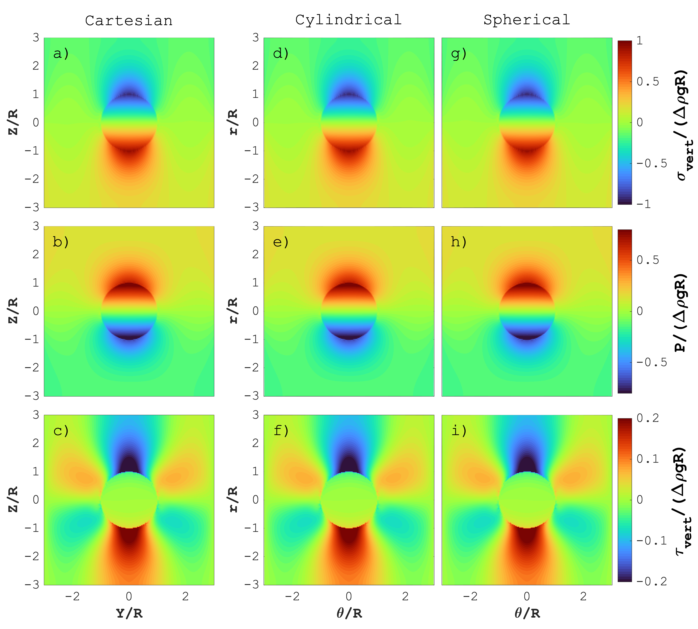
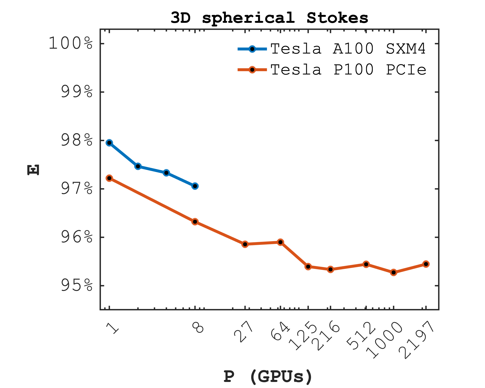

# SphericalStokes


Stokes flow in spherical, cylindrical and Cartesian coordinates.

The GPU Julia HPC scripts in this repository relate to Stokes flow in different systems of coordinates developed for two studies.

> The following figure compares the result of a buoyantly rising sphere using spherical, cylindrical and Cartesian coordinates.



## Diapir ascent
The [scripts_diapir](scripts_diapir) relate to the following publication: "Quantifying diapir ascent velocities in power-law viscous rock under far-field stress: Integrating analytical estimates, 3D numerical calculations and geodynamic applications":
```tex
@Article{xyz,

}
```

## Plateau
The [scripts_plateau](scripts_plateau) relate to the following publication: "3D stresses and gravitational spreading velocities in continental plateaus: Analytical estimates, numerical calculations with Earth's curvature and cpplication to the Tibetan plateau":
```tex
@Article{xyz,

}
```

## Performance
The [scripts_perf](scripts_perf) are used to evaluate the performance of the multi-GPU application.

> The following figure reports a less than 3% drop in parallel performance from 1 to 2197 GPUs on the Piz Daint supercomputer at CSCS.


